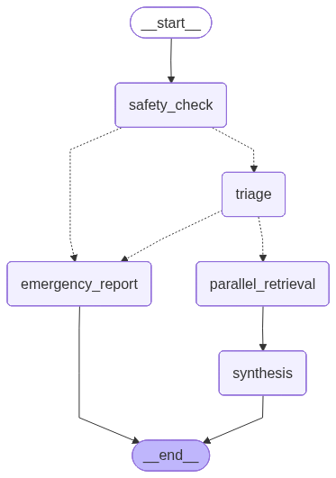

# CliniBridge

CliniBridge is an AI-powered multi-agent clinical alert orchestration system. It takes a simulated Remote Patient Monitoring (RPM) alert, retrieves relevant Electronic Health Record (EHR) and anamnesis context, and produces a structured Clinical Context Brief for clinician review.

The project is built as an educational prototype using simulated patient data. It focuses on combining disconnected clinical information into a single readable summary.

## What The Project Does

CliniBridge processes a clinical alert through a multi-agent workflow:

1. A safety check reviews the alert against hardcoded escalation thresholds.
2. A triage agent classifies urgency and generates retrieval queries.
3. An EHR agent retrieves relevant medical history and structured facts.
4. An anamnesis agent retrieves relevant self-reported patient context.
5. A synthesis agent combines all outputs into a final Clinical Context Brief.
6. The system stores the result as:
   - a JSON audit log
   - a PDF clinical brief

## Workflow Graph

The graph below shows the overall workflow used by the orchestrator.



## Main Components

- `Orchestrator`
  - coordinates the workflow
  - handles routing between nodes
  - saves audit logs and PDFs

- `Safety Check`
  - decides whether the alert should escalate immediately

- `Triage Agent`
  - classifies alert severity
  - formulates EHR and anamnesis search queries

- `EHR Agent`
  - retrieves clinically relevant information from the patient EHR

- `Anamnesis Agent`
  - retrieves self-reported patient context such as symptoms, adherence, and lifestyle

- `Synthesis Agent`
  - produces the final Clinical Context Brief

## Project Structure

```text
CliniBridge/
├── main.py
├── graph.png
├── README.md
├── Agents/
├── ChatAgent/
├── Embedder/
├── Orchestrator/
├── ToolCalling/
└── data/
    ├── alerts/
    └── patients/
```

## Data Layout

Each patient is stored under:

```text
data/patients/<PATIENT_ID>/
```

A patient folder may contain:

- `information/`
  - `ehr.json`
  - `anamnesis.json`

- `embeddings/`
  - saved FAISS indexes and maps

- `logs/`
  - generated JSON audit logs
  - generated PDF clinical briefs

Example:

```text
data/patients/P001/logs/
data/patients/P002/logs/
```

## How To Run

The project runs from:

```text
main.py
```

Run it with:

```powershell
python main.py
```

## How To Change The Scenario

Open `main.py` and change the scenario file name in this section:

```python
with open(os.path.join(BASE_DIR, "data", "alerts", "scenario_1.json"), "r") as f:
    alert = json.load(f)
```

For example, to run another scenario:

```python
with open(os.path.join(BASE_DIR, "data", "alerts", "scenario_2.json"), "r") as f:
    alert = json.load(f)
```

Then run:

```powershell
python main.py
```

## Output

For each run, CliniBridge produces:

- terminal output with the final structured result
- a JSON audit log
- a PDF clinical brief

These files are stored in the matching patient folder under:

```text
data/patients/<PATIENT_ID>/logs/
```

Example:

```text
data/patients/P001/logs/P001_YYYYMMDD_HHMMSS.json
data/patients/P001/logs/P001_YYYYMMDD_HHMMSS.pdf
```

If a patient ID is missing, the system uses:

```text
data/patients/unknown/logs/
```

## Clinical Brief Output

The final Clinical Context Brief is synthesized from:

- the original RPM alert
- the triage output
- EHR findings
- anamnesis findings

The brief is intended to summarize:

- what triggered the alert
- the patient’s relevant context
- possible risks
- suggested next actions
- missing information or uncertainty


