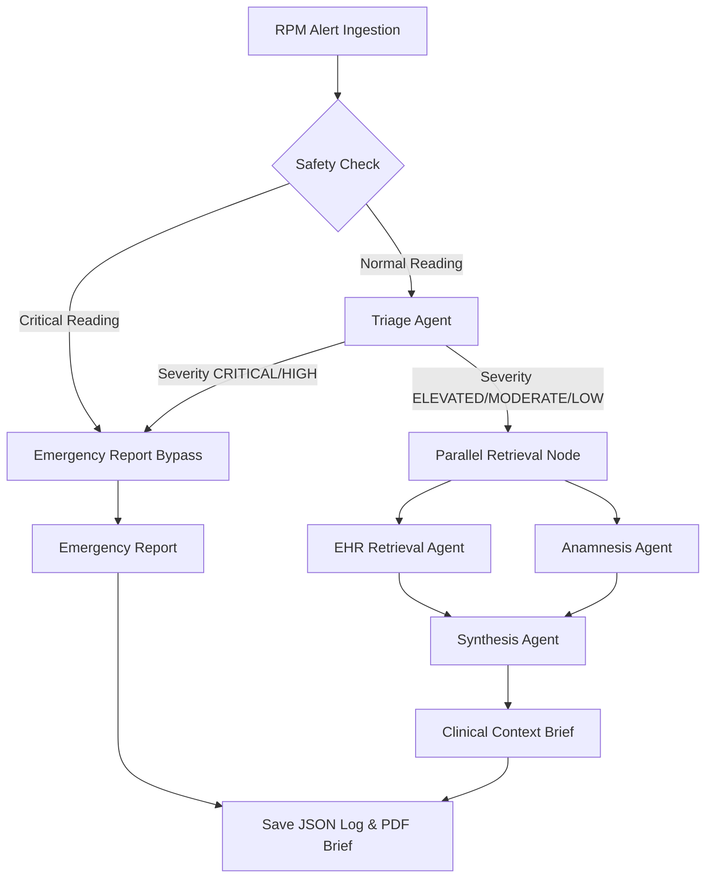

# Capstone Project Report: CliniBridge
### Bridging the Clinical Context Gap: An LLM-Powered Multi-Agent System for Synthesizing EHR, RPM, and Anamnesis Data

**Course**: COP-3442: Prompt Engineering  
**Date**: June 13, 2026  

---

## 1. Executive Summary

CliniBridge is an intelligent, multi-agent clinical decision-support prototype designed to resolve the clinical context gap—the fragmentation of patient information across Electronic Health Records (EHR), Remote Patient Monitoring (RPM) streams, and self-reported patient intake logs (Anamnesis). 

By leveraging Large Language Models structured within a LangGraph state machine, CliniBridge automates the retrieval of patient history, correlates it against real-time telemetry alarms, and synthesizes a structured, cited **Clinical Context Brief (CCB)** that a physician can read in under 60 seconds. To guarantee safety in clinical environments, the system incorporates a hardcoded critical threshold safety bypass that routes high-risk alerts to clinicians immediately, bypassing LLM processing.

---

## 2. Problem Statement: The Clinical Context Gap

Modern healthcare providers operate under extreme cognitive load due to three disconnected dimensions of patient data:
1.  **Electronic Health Records (EHR - The Past)**: Store longitudinal records, medications, and labs. However, they are static, frequently unstructured, and isolated.
2.  **Remote Patient Monitoring (RPM - The Present)**: Generate time-series vital readings from home devices. These suffer from a high rate of false alarms, leading to alarm fatigue (where 85–95% of alarms are clinically non-actionable).
3.  **Anamnesis (The Patient's Voice)**: Self-reported symptom diaries and adherence logs. These are rarely integrated with clinical EHR systems in real time.

When an RPM alert triggers, clinicians must manually hunt for context across these systems, leading to delayed interventions or ignored critical alarms. CliniBridge acts as an intelligent intermediary to bridge this context gap.

---

## 3. Proposed Solution Architecture

CliniBridge is designed as a five-component multi-agent system coordinated by a central orchestrator. The workflow uses a linear-then-convergent graph flow implemented via LangGraph.

### 3.1 Data Flow Sequence
1.  **Alert Ingestion**: Raw RPM telemetry enters the system.
2.  **Safety Check**: The telemetry is compared against hardcoded thresholds. If exceeded, it bypasses LLMs and routes to emergency reporting.
3.  **Triage Agent**: Classifies the alert severity (CRITICAL, HIGH, ELEVATED, MODERATE, LOW). High/Critical alerts are routed to the emergency reporting node. Lower alerts generate search queries.
4.  **Parallel Retrieval Node**: Executes semantic database RAG queries for the EHR and Anamnesis agents in parallel.
5.  **Synthesis Agent**: Integrates the retrieval findings and generates the final CCB.
6.  **Persistence**: The orchestrator saves the results as a JSON audit log and a printable PDF brief.

---

## 4. System Components and Prompt Design

### 4.1 Central Orchestrator
*   **Implementation**: Coordinated in [orchestrator.py](file:///d:/Workspace/Projects/PromptProject/CliniBridge/Orchestrator/orchestrator.py) and [state.py](file:///d:/Workspace/Projects/PromptProject/CliniBridge/Orchestrator/state.py).
*   **Routing**: Defined in [router.py](file:///d:/Workspace/Projects/PromptProject/CliniBridge/Orchestrator/router.py). Conditional edges determine graph routing based on state updates.

### 4.2 Safety Check Node
*   **Implementation**: Coded in [safety_check.py](file:///d:/Workspace/Projects/PromptProject/CliniBridge/Orchestrator/safety_check.py).
*   **Thresholds**:
    *   Blood Pressure: $\ge$ 200/120 mmHg
    *   Heart Rate: $<$ 30 or $>$ 160 bpm
    *   SpO2: $<$ 88%
    *   Blood Glucose: $<$ 50 or $>$ 400 mg/dL

### 4.3 Alert Triage Agent
*   **Purpose**: Processes the alert and identifies which aspects of the EHR and Anamnesis are relevant.
*   **Prompt Constraints**: Includes distinct severity scoring metrics, few-shot telemetry examples, and instructions to generate structured arrays for EHR and Anamnesis queries.

### 4.4 EHR Retrieval Agent
*   **Purpose**: Calls semantic search tools on the patient's EHR database.
*   **Prompt Constraints**: Restricts the LLM to a clinical data analyst role. Directs it to extract active conditions, active prescriptions, and recent lab baselines, and to explicitly log missing data under `missing_data` instead of guessing.

### 4.5 Anamnesis Agent
*   **Purpose**: Formulates queries to extract subjective patient data.
*   **Prompt Constraints**: Instructs the agent to translate patient vocabulary into clinical terminology while preserving original quotes. Includes guidelines on recording medication adherence and maintaining behavioral neutrality.

### 4.6 Synthesis Agent
*   **Purpose**: Generates the structured CCB.
*   **Prompt Constraints**:
    *   *Anti-Hallucination*: All analytical statements must cite sources using `(EHR)` or `(Anamnesis)`.
    *   *Diagnostic Protection*: Forces the model to use non-definitive clinical language (e.g. `may suggest`, `could indicate`, `consider`).
    *   *Required Sections*: Enforces a 6-part JSON structure (Alert Summary, Patient Snapshot, Contextual Analysis, Risk Assessment, Recommended Actions, Uncertainties and Gaps).

---

## 5. Dataset and Scenario Design

The simulated patient database contains a cohort of 10 chronic disease patients (`P001` to `P010`) located under [patients/](file:///d:/Workspace/Projects/PromptProject/CliniBridge/data/patients/).

*   **EHR files** (`ehr.json`): Structured demographics, active ICD-10 conditions, active prescriptions, recent lab baselines, and visit notes.
*   **Anamnesis files** (`anamnesis.json`): Chief complaints, onset diaries, symptom severity, lifestyle factors, family histories, and patient concerns.
*   **Embeddings**: FAISS index stores pre-computed vector chunks using the `all-MiniLM-L6-v2` SentenceTransformer model, enabling fast local RAG search.

### Test Scenarios
Five clinical validation alerts are defined under [alerts/](file:///d:/Workspace/Projects/PromptProject/CliniBridge/data/alerts/):
1.  **Scenario 1 (Missed Medication)**: A hypertensive patient's BP spikes after self-discontinuing Lisinopril due to a dry cough.
2.  **Scenario 2 (False Alarm)**: A high glucose reading due to a planned dietary change.
3.  **Scenario 3 (Silent Deterioration)**: Gradual weight gain trend in a congestive heart failure patient indicating fluid retention.
4.  **Scenario 4 (Incomplete Record)**: Elevated blood pressure in a new patient with sparse EHR history.
5.  **Scenario 5 (Conflicting Data)**: Elevated blood pressure where the patient reports full adherence but recent lab assays show sub-therapeutic drug levels.

---

## 6. Ethical Design & Known Limitations

### 6.1 Safety Principles
*   **Human-in-the-Loop**: The CCB is designed strictly to support, not replace, clinical decisions. All actions are framed as suggestions.
*   **Transparency**: Every brief includes confidence scores and highlights missing information under the `uncertainties_and_gaps` section.
*   **Fail-Safe Design**: Telemetry readings that meet critical thresholds immediately trigger the safety check, bypassing LLMs to route directly to emergency notifications.

### 6.2 Known Limitations
*   **LLM Hallucination Risk**: Despite schema checks and citation requirements, LLM hallucination risk remains non-zero. A production system would require extra validator layers (such as guardrails.ai or Pydantic validation).
*   **RAG Boundaries**: Semantic search accuracy depends on quality text chunking and indexing. Sparse patient files limit context generation accuracy.
*   **Static Simulation**: The system operates on static JSON cohorts and does not support real-time data streaming.
